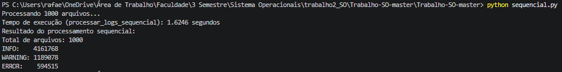
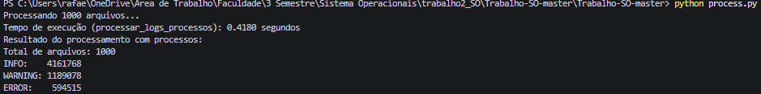
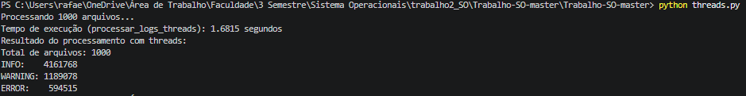

# Trabalho de SO — Processamento de Logs

Programa que processa 1000 arquivos de log e conta as mensagens `INFO`, `WARNING` e `ERROR`, em três versões: sequencial, com processos (`multiprocessing`) e com threads (`ThreadPoolExecutor`).

## Como rodar

```bash
python3 gerador_arquivos.py 
python3 sequencial.py
python3 process.py
python3 threads.py
```

## Resultados

```
Total de arquivos: 1000
INFO:    4161768
WARNING: 1189078
ERROR:    594515
```

| Versão     | Tempo         |
|------------|--------------:|
| Sequencial | 1,6246 s      |
| Processos  | 0,4180 s      |
| Threads    | 1,6815 s      |





## Conclusão

**Processos** foi a versão mais rápida: cada processo tem seu próprio interpretador Python, então o trabalho de contar as linhas roda de verdade em paralelo em vários núcleos da CPU.

**Threads** ficou mais lenta até que a sequencial. Isso acontece porque o GIL do Python só deixa uma thread executar código Python por vez, e contar as mensagens é justamente trabalho de CPU (não só de I/O). As threads só adicionaram overhead de criação e do lock, sem ganho real, então para essa tarefa, processos venceram porque o gargalo é CPU, não I/O.
