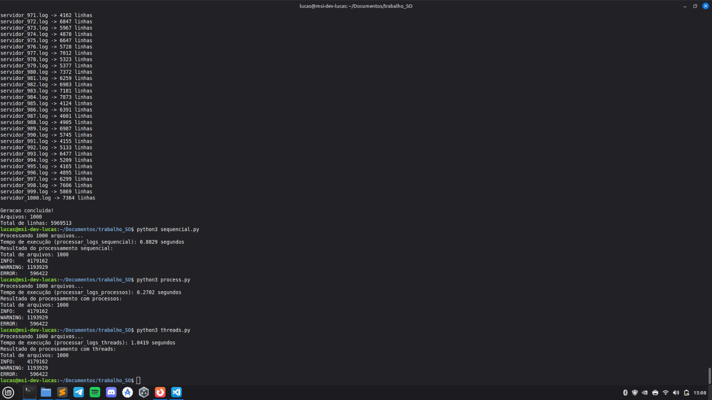
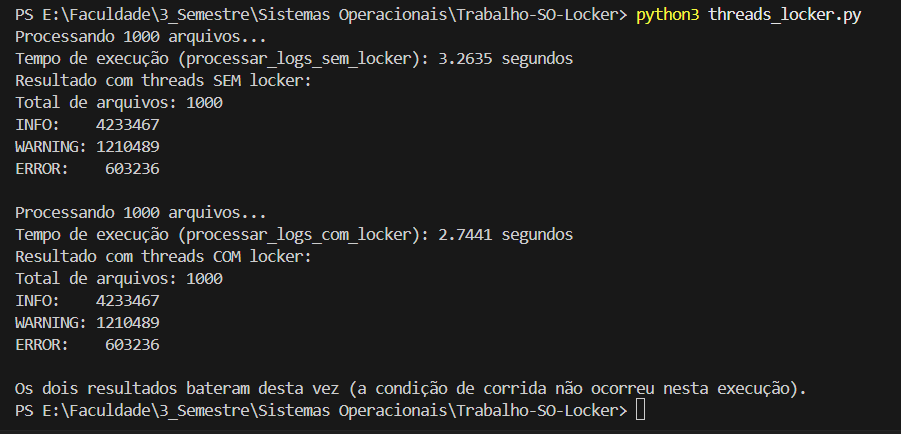

# Trabalho de SO — Processamento de Logs

Programa que processa 1000 arquivos de log e conta as mensagens `INFO`, `WARNING` e `ERROR`, em quatro versões: sequencial, com processos (`multiprocessing`), com threads (`ThreadPoolExecutor`) e com threads usando um locker (`threading.Lock`).

## Como rodar

```bash
python3 gerador_arquivos.py 
python3 sequencial.py
python3 process.py
python3 threads.py
python3 threads_locker.py
```

## Resultados - PC do Lucas

```
Total de arquivos: 1000
INFO:    4179162
WARNING: 1193929
ERROR:    596422
```

| Versão     | Tempo         |
|------------|--------------:|
| Sequencial | 0,8829 s      |
| Processos  | 0,2702 s      |
| Threads    | 1,0419 s      |



## Resultados do PC do Rafael

```
Total de arquivos: 1000
INFO:    4161768
WARNING: 1189078
ERROR:    594515
```

| Versão     | Tempo         |
|------------|--------------:|
| Sequencial | 1,6246 s      |
| Processos  | 0,4180 s      |
| Threads    | 1,6815 s      |


## Conclusão

**Processos** foi a versão mais rápida: cada processo tem seu próprio interpretador Python, então o trabalho de contar as linhas roda de verdade em paralelo em vários núcleos da CPU.

**Threads** ficou mais lenta até que a sequencial. Isso acontece porque o GIL do Python só deixa uma thread executar código Python por vez, e contar as mensagens é justamente trabalho de CPU (não só de I/O). As threads só adicionaram overhead de criação e do lock, sem ganho real, então para essa tarefa, processos venceram porque o gargalo é CPU, não I/O.

## Locker (`threads_locker.py`)

Na versão `threads.py`, cada thread devolve sua própria contagem e só a thread principal soma no total, então nenhuma variável é disputada. No `threads_locker.py`, todas as threads escrevem no **mesmo contador compartilhado** (`total`), e por isso ele precisa ser protegido por uma trava (`threading.Lock`, chamada de `locker`).

- **Sem locker:** cada thread lê o valor do contador e grava o valor + 1. Se duas threads lerem o mesmo valor antes de alguma gravar, uma das somas se perde. Isso é uma **condição de corrida** e pode deixar o resultado final menor do que o correto.
- **Com locker:** cada thread conta seu arquivo numa variável local e depois entra na **seção crítica** (`with locker:`) para somar no total. Só uma thread por vez entra ali, então nenhuma contagem se perde.

O locker **não muda o resultado correto**: com ele, os totais de INFO, WARNING e ERROR são iguais aos das versões sequencial, processos e threads. O que muda é a **garantia** de que o resultado vai sair certo quando várias threads mexem na mesma variável, com um pequeno custo de tempo, porque as threads precisam esperar a vez na trava.

Observação: no Python comum, o GIL faz com que a condição de corrida aconteça raramente, então a versão sem locker pode acertar em algumas execuções. Mesmo assim ela não é segura: nada garante o resultado, e em outras linguagens (ou no Python sem GIL) o erro aparece com muito mais frequência.

### Resultados do locker - PC do Rafael

```
Total de arquivos: 1000
INFO:    4233467
WARNING: 1210489
ERROR:    603236
```

| Versão                | Tempo    |
|-----------------------|---------:|
| Threads SEM locker    | 3,2635 s |
| Threads COM locker    | 2,7441 s |



Os totais deram iguais nas duas versões: nesta execução a condição de corrida não aconteceu, o que é esperado por causa do GIL. Os números são diferentes das tabelas anteriores porque o `gerador_arquivos.py` cria logs aleatórios a cada vez que é executado.

A versão **com locker foi mais rápida** que a sem locker. Isso acontece porque, sem locker, as threads atualizam o contador compartilhado a cada linha (milhões de acessos à mesma variável), enquanto com locker cada thread conta o arquivo numa variável local e só entra na seção crítica uma vez por arquivo (1000 vezes no total). Ou seja, usar o locker do jeito certo, segurando a trava pelo menor tempo possível, deixa o programa correto sem perder desempenho.
